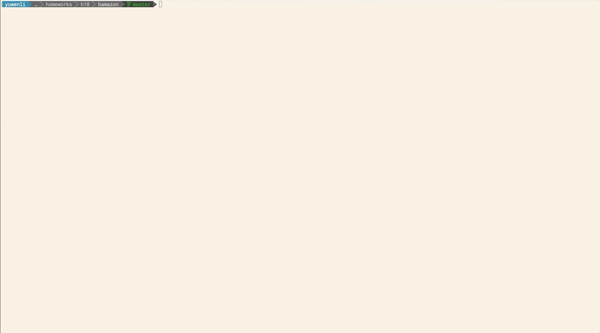

# Bamazon

## Getting Started

This is a node.js application that run to simulate amazon. The application has three mode:

1. `customer mode` -- display and sell product to customer;
2. `manager mode` -- for manager to view products and add stocks or products;
3. `supervisor mode` -- for supervisor to keep track of sales, profits and add department.

There are some demo below for you to check out.

### Prerequisites

To get started please first follow the steps below

1. Clone the whole repository and get into the directory in your terminal.
2. In your terminal, type in  `npm install`  to set up all the required modules **inquirer**, **mysql**, **console.table**.
3. Change the port, user, passwaord information to match your MySQL setting.
4. Run the bamazon_db.sql and then the departments.sql on your MySQL.

## How to use it

#### `Customer Mode`

- In your terminal, type in  `node bamazonCustomer.js`  to run the customer mode;
- Follow the instructions on screen to enter the item id and amount you'd like to buy;
- If your order is successfully placed, message and total price will show up in the terminal
- In database (MySQL) the quantity of the product will be altered.

#### `Manager Mode`

- In your terminal, type in  `node bamazonManager.js`  to run the manager mode;
- There are four options:
  - View Products for Sale: if you select this option, the inventory will display with all the available products;

  - View Low Inventory: if you select this option, the products with less than 5 stock quantity will show up;

  - Add to Inventory: if you select this option, you can follow the instructions to add more stock to one of the product;

  - Add New Product: if you select this option, you can follow the instructions to add brand new product to the inventory;

- In database (MySQL) the quantity of the products that manager add more to will be altered and new products will be added to the products table.

#### `Supervisor Mode`
- In your terminal, type in  `node bamazonSupervisor.js`  to run the supervisor mode;
- There are two options:
  - View Product Sales by Department: if you select this option, a table with department name, over head cost, product sales and total profit will show up;

  - Create New Department: if you select this option, you can follow the instructions to add brand new department to the inventory;

- In database (MySQL) the new department will be added to the departments table.

## Authors

* **Yuwen Li** - *Initial work* - [Github](https://github.com/muzlee1113)

